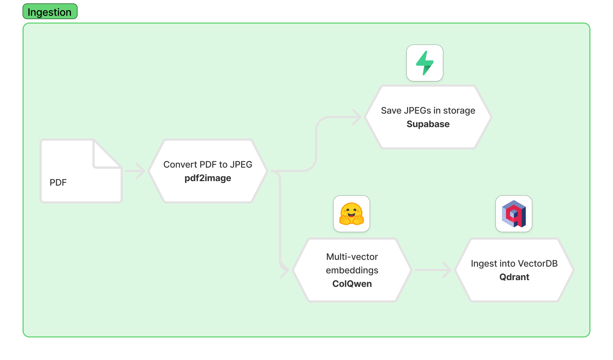
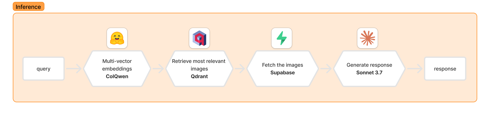

<h1 align="center">ColPali RAG App</h1>
<div align="center">
    <a align="center" href="https://www.python.org/downloads/release/python-3128/"></a>
    <a href="https://fastapi.tiangolo.com/"></a>
    <a href="https://github.com/astral-sh/uv"></a>
    <a href="http://mypy-lang.org/"></a>
    <a href="https://github.com/astral-sh/ruff"></a>
</div>

## UI prototype
The UI prototype can be found [here]()

*Note:* The UI will be available for limited time since I need to pay for the hosting.

## Context
ColPali is a document retrieval method that leverages Vision Language Models (VLMs) to index and retrieve information directly from document images, bypassing traditional text extraction methods. By processing entire document pages as images, ColPali captures both textual content and visual elements—such as tables, figures, and layouts—thereby preserving the document's original structure and context.


You can find more information about this method in the [ColPali paper](https://arxiv.org/abs/2407.01449). They also have a [ColPali repository](https://github.com/illuin-tech/colpali) with the code and models.

## Description
This repository contains the backend for a retrieval augmented generation (RAG) application that leverages the ColPali method. Specifically it uses [ColQwen 2.5 (v0.2)](https://huggingface.co/vidore/colqwen2.5-v0.2) which folows ColPali method to index and retrieve information directly from document images. The backend is built using FastAPI, and uses Qdrant for vector search and Supabase for storage.

### Ingestion
During the ingestion process, the application converts PDFs into JPEGs using the Python **pdf2image** library. These images are then uploaded to Supabase storage and indexed using Qdrant. To extract embeddings from the images, the application utilizes ColQwen 2.5.


### Inference
At inference time, the application queries the Qdrant collection using the ColQwen 2.5 embeddings of the query. It returns the top-k results (images) from the collection. Note that Qdrant stores references to the images, not the images themselves. The application fetches these images from Supabase and uses them with a multimodal model (Claude Sonnet 3.7) to generate the response.



## Stack
* Programming Language: [Python 3.12.8](https://www.python.org/)
* ColPali: [colpali-engine](https://github.com/illuin-tech/colpali)
* LLM Framework: [Instructor](https://python.useinstructor.com/)
* VectorDB: [Qdrant](https://qdrant.tech/)
* Storage: [Supabase](https://supabase.com/)
* Framework: [FastAPI 0.115.8](https://fastapi.tiangolo.com/)
* Dependency & Package Manager: [uv](https://docs.astral.sh/uv/)
* Linters: [Ruff](https://docs.astral.sh/ruff/)
* Type Checking: [MyPy](https://mypy-lang.org/)
* Deployment: [Docker](https://www.docker.com/)

## Configure

1. **Clone the Git repository to your local machine:**
```shell
git clone https://github.com/jjovalle99/colpali-rag-app.git
cd colpali-rag-app
```

2. **Copy the stub `.env copy` file to `.env` and replace placeholder values with the required credentials**:
```shell
cp .env\ copy .env
```
```
# RAG
QDRANT_URL=fillme
QDRANT_API_KEY=fillme
COLLECTION_NAME=fillme

# STORAGE
SUPABASE_URL=fillme
SUPABASE_KEY=fillme

# ANTHROPIC
ANTHROPIC_API_KEY=fillme
```

3. **Create your (empty) Qdrant collection**
```shell
make create_collection
```

## Installation and Usage

There are two ways to run the application: using Docker or running it locally in the shell.

### Using `Docker`

1. **Ensure Docker is installed on your machine.** For more information, visit the official [Docker documentation](https://docs.docker.com/).

2. **Build the Docker image:**

   ```shell
   make docker_build
   ```
   **Note**: The docker image is about 2.1GB in size.

3. **Run the Docker container:**

   ```shell
    make docker_run
    ```
    **Note:** This will work only if you have the required credentials in the `.env` file.    
    **Note:** You can inspect the running container by running `make docker_logs`.

4. **Access the application docs.** Visit the app docs at [http://localhost:8000/docs](http://localhost:8000/docs). If everything is working correctly, you'll see the UI.

5. **Stop the Docker container:**

   ```shell
   make docker_stop
   ```

### Running Locally in the Shell

1. **Install `uv` by following the instructions** [here](https://docs.astral.sh/uv/getting-started/installation/).

2. **Install poppler-utils:**

```shell
sudo apt-get install poppler-utils
```

3. **Install the dependencies and package:**

```shell
uv sync --all-groups
```

4. **Start the API:**

   ```shell
   make dev
   ```
    **Note:** This will work only if you have the required credentials in the `.env` file.

5. **Access the application and database.** Visit the default app path at [http://localhost:8000](http://localhost:8000). If everything is working correctly, you'll see the UI.

6. **Stop the application and background services.** Terminate the processes you (this may involve using `Ctrl+C` in the terminal)

## Structure
```shell
├── Dockerfile
├── Makefile
├── README.md
├── assets
├── prompts
│   ├── response_1
│   └── response_2
├── pyproject.toml
├── pyrightconfig.json
├── scripts
│   └── create_collection.py
├── server.py
├── src
│   └── app
│       ├── __init__.py
│       ├── api
│       │   ├── __init__.py
│       │   ├── dependencies.py
│       │   ├── endpoints
│       │   │   ├── __init__.py
│       │   │   ├── pdf_ingest.py
│       │   │   └── query.py
│       │   ├── lifespan.py
│       │   └── state.py
│       ├── colpali
│       │   ├── __init__.py
│       │   └── loaders.py
│       ├── models
│       │   ├── __init__.py
│       │   └── query_response.py
│       ├── services
│       │   ├── __init__.py
│       │   ├── img_downloader.py
│       │   └── img_uploader.py
│       ├── settings.py
│       └── utils
│           ├── __init__.py
│           ├── prompt_utils.py
│           └── qdrant_utils.py
├── test.ipynb
└── uv.lock
```
